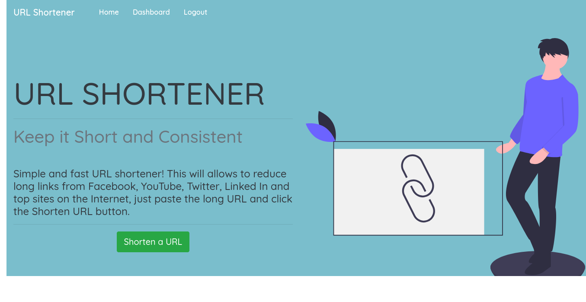
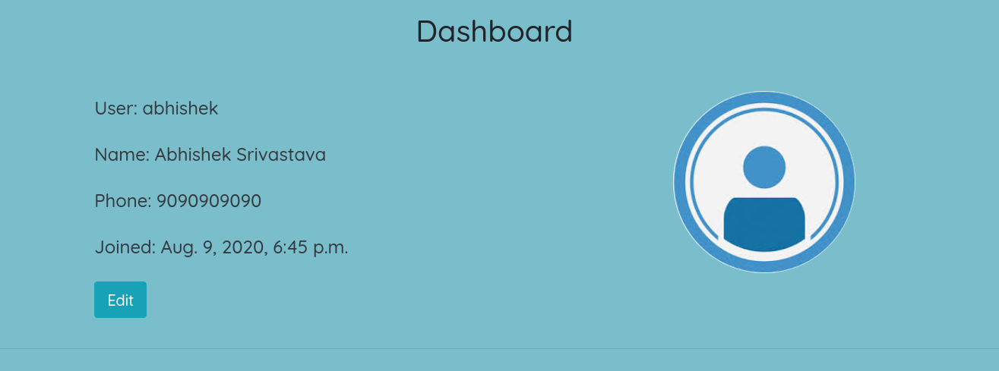
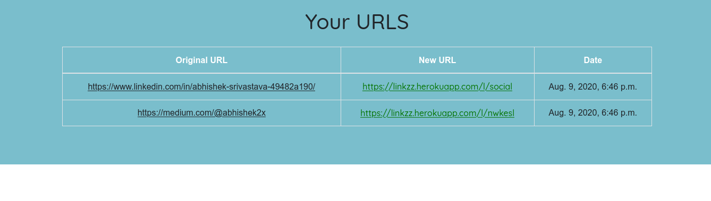

# LINKZZ URL SHORTENER

>##  Keep it Short and Consistent 

***

### A Bried Idea

***Simple and fast URL shortener! This will allows to reduce long links from Facebook, YouTube, Twitter, Linked In and top sites on the Internet, just paste the long URL and click the Shorten URL button.***
 
Let's say you have a URL. You need to send that URL in an SMS. You will be having a character limit for SMS. So it would be nice to shorten your URL to something smaller. 

***

## Linkzz Shortener

***

## Tech Stack Involved

 
 

***

# Images

## Login

## Register

## Dashboard

## URL-Shortener

## Your URLS

***

# Link to the Live Demo

**linkzz website url  ->** <a href="https://linkzz.herokuapp.com/">Live Demo</a>

***

